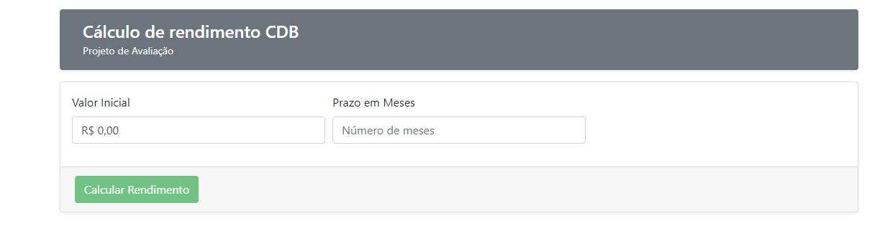
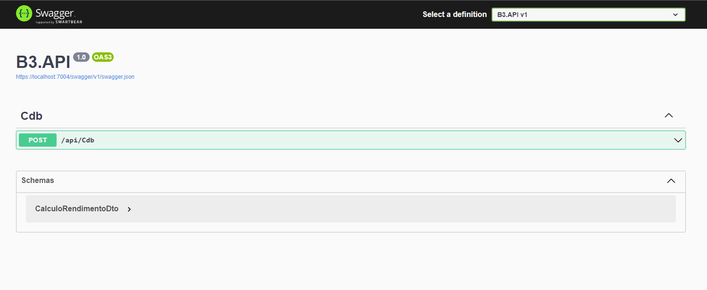
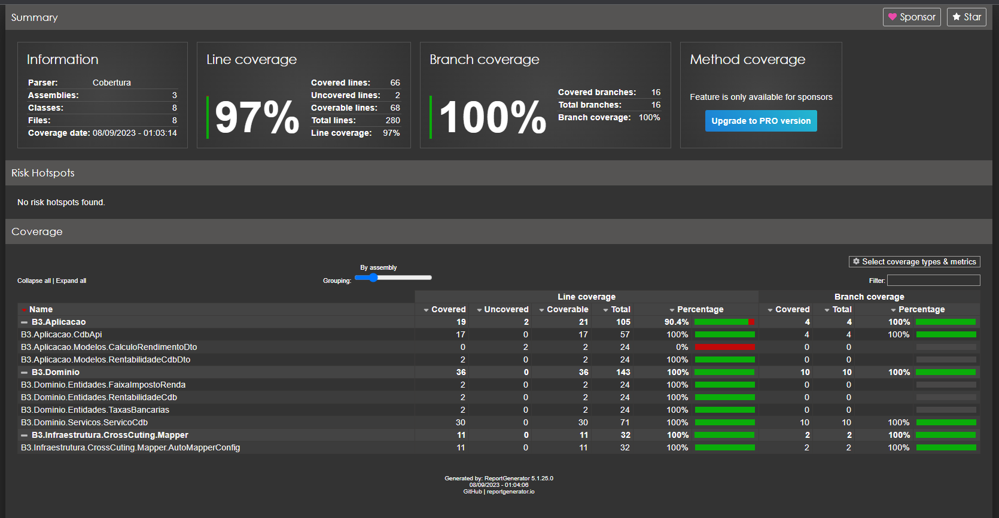
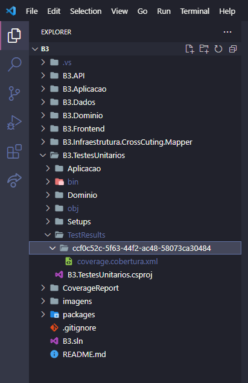

<a name="readme-top"></a>
<h3 align="center">[B]³ - Projeto de avaliação</h3>

<!-- Tabela de conteúdo -->
<details>
  <summary>Conteúdo</summary>
  <ol>
    <li><a href="#sobre-o-projeto">Sobre o projeto</a></li>
    <li>
      <a href="#execução">Execução</a>
      <ul><li><a href="#aplicação">Aplicação</a></li></ul>
      <ul><li><a href="#api">API</a></li></ul>
    </li>
    <li><a href="#code-coverage">Code Coverage</a></li>
  </ol>
</details>

<!-- Sobre o projeto -->
## Sobre o projeto


Aplicação para o cálculo do de um investimento a partir de um valor inicial e um prazo em meses para o resgate. <br>
Após o cálculo, o sistema apresenta o resultado bruto e líquido do investimento.

Requisitos:
* O valor inicial deve ser positivo e maior que zero
* O prazo em meses pra o resgate da aplicação deve ser maior que um

<!-- Execução -->
## Execução
1. Clonar o repositório
```sh
git clone https://github.com/danieltostes/B3.git
```

### Aplicação
2. Navegar até o diretório B3.Frontend e instalar as dependências via NPM
```sh
npm install
```

3. Executar o comando para rodar a aplicação
```sh
ng serve -o
```

<p>(<a href="#readme-top">Voltar ao topo</a>)</p>

### API
4. Abrir outro terminal e navegar até o diretório B3.API
5. Compilar o projeto .net
```sh
dotnet build
```

6. Executar o projeto API
```sh
dotnet watch run
```


<p>(<a href="#readme-top">Voltar ao topo</a>)</p>

### Code Coverage


O relatório de cobertura foi gerado utilizando a dependência <a href="https://reportgenerator.io/usage">ReportGenerator</a> <br>
O último relatório de cobertura de testes está disponível no diretório CoverageReport/index.html <br>
Para atualizar o relatório é necessário seguir os passos abaixo:

7. Instalar o ReportGenerator globalmente
```sh
dotnet tool install --global dotnet-reportgenerator-globaltool --version 5.1.25
```

8. Rodar os testes unitários com a instrução para gerar os arquivos xml com os resultados do teste
```sh
dotnet test --collect "Xplat Code Coverage"
```

9. Copiar o nome da pasta com o teste desejado gerado no diretório B3.TestesUnitarios/TestResults
```
O nome da pasta é um hash no padrão semelhante a ccf0c52c-5f63-44f2-ac48-58073ca30484
```


10. Gerar o relatório de cobertura de testes (o comando deve ser executado no diretório raiz do repositório)
```sh
reportgenerator -reports:.\B3.TestesUnitarios\TestResults\[nome da pasta dos testes unitários]\coverage.cobertura.xml -targetdir:CoverageReport
```

11. Abrir o arquivo CoverageReport/index.html

<p>(<a href="#readme-top">Voltar ao topo</a>)</p>
